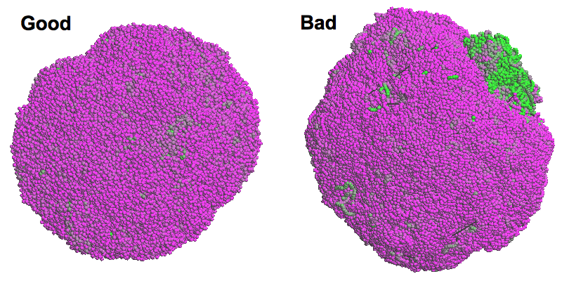

## <a name="start"></a>Getting Started
```sh
# Download precompiled binaries for Linux
curl -L https://github.com/lh3/hickit/releases/download/v0.1/hickit-0.1_x64-linux.tar.bz2 | tar -jxf -
cd hickit-0.1_x64-linux

# Map Dip-C reads and extract contacts (skip if you use your own pipeline)
./seqtk mergepe read1.fq.gz read2.fq.gz | ./pre-dip-c - | bwa mem -5SP -p hs37d5.fa - | gzip > aln.sam.gz
./k8 hickit.js vcf2tsv phased.vcf > phased_SNP.tsv   # extract phased SNPs from VCF
./k8 hickit.js sam2seg -v phased_SNP.tsv aln.sam.gz | ./k8 hickit.js chronly - | gzip > contacts.seg.gz
./hickit -i contacts.seg.gz -o - | bgzip > contacts.pairs.gz  # optional

# Impute phases (-i also works with contacts.seg.gz)
./hickit -i contacts.pairs.gz -u -o - | bgzip > impute.pairs.gz
./hickit -i contacts.pairs.gz --out-val=impute.val     # estimate imputation accuracy by holdout
# Infer 3D structure
./hickit -i impute.pairs.gz -Sr1m -c1 -r10m -c5 -b4m -b1m -b200k -D5 -b50k -D5 -b20k -O imput.3dg

# 2D contact map in PNG (bin size determined by the image width)
./hickit -i impute.pairs.gz --out-png impute.png
# Compute CpG density (optional)
./hickit.js gfeat -r hs37d5.fa.gz imput.3dg | gzip > imput.cpg.3dg.gz
# Visualize 3D structure (requiring a graphical card)
./hickit-gl -i imput.cpg.3dg.gz --view
```

## Table of Contents

* [Getting Started](#start)
* [Introduction](#intro)
* [Installation](#install)
* [Users' Guide](#guide)
  - [Terminologies](#term)
  - [File formats](#format)
    - [The pairs format](#pairs)
    - [The 3dg format](#3dg)
    - [The seg format](#seg)
  - [Generating contacts in the pairs format](#gen-pairs)
    - [Aligning Hi-C reads](#aln-hic)
    - [Extracting contact pairs](#extract-pairs)
  - [Imputing missing phases (diploid single-cell Hi-C only)](#impute)
  - [Inferring 3D structures (single-cell only)](#infer-3d)
* [Related Projects](#related)
* [Limitations](#limit)

## <a name="intro"></a>Introduction

Hickit is a set of tools initially developed to process diploid single-cell
Hi-C data. It extracts contact pairs from read alignment, identifies phases of
contacts overlapping with SNPs of known phases, imputes missing phases, infers
the 3D structure of a single cell and visualizes the structure. Part of the
hickit functionality also works with bulk Hi-C data. In particular, hickit
implements a fast (untested) binning-free TAD calling algorithm and an
efficient neighboring contacts counter which can be adapted to ultrafast loop
calling.

## <a name="install"></a>Installation

Hickit depends on [zlib][zlib]. The command-line tools can be compiled by
typing `make` in the source code directory. The 3D viewer further requires
OpenGL and GLUT and can be compiled with `make gl=1`.

## <a name="guide"></a>Users' Guide

Hickit keeps one list of contacts and sometimes one 3D structure in memory. It
has two types of command-line switches: actions and settings. An action switch
modifies the in-memory bulk data or outputs them; a setting switch changes
parameters but doesn't modify bulk data. Hickit applies switches sequentially
as they appear on the command line. As such, **the order of command-line switches
often affects the final result**.

The following command line does imputation and multiple rounds of 3D
reconstruction altogether:
```sh
hickit -i in.pairs -u -o imput.pairs -Sr1m -c1 -r10m -c5 -b4m -b1m -b200k -D5 -b50k -D5 -b20k -O out.3dg
```
It reads input contacts (action `-i`), imputes missing phases (action `-u`) and
outputs imputed contacts (action `-o`), which are still stored in memory. Then
hickit separates the two homologous chromosomes (action `-S`), filters isolated
contacts in two rounds (`-r1m -c1 -r10m -c5`, where `-r` is a setting and `-c`
is an action), and applies five rounds of 3D modeling (the four `-b` actions)
with each at a higher resolution. The final resolution is at 20kb and written
to file `out.3dg` (action `-O`).

This long command line can be decomposed into shorter ones by keeping more
intermediate files:
```sh
hickit -i in.pairs -u -o imput.pairs
hickit -i imput.pairs -Sr1m -c1 -r10m -c5 -o imput.flt.pairs
hickit -i imput.flt.pairs -b4m -b1m -b200k -O coarse.3dg
hickit -i imput.flt.pairs -I coarse.3dg -D5 -b50k -D5 -b20k -O out.3dg
```
It is also possible to output intermediate files by using more output actions
in the long command line.

### <a name="term"></a>Terminologies

A *contact* is a pair of chromosomal coordinates that are supposed to be close
to each other, inferred from Hi-C or other 3C technologies. A *contact pair* or
sometimes a *pair* is taken as a synonym of contact. A *leg* is one of the two
chromosomal coordinates in a contact pair.

### <a name="format"></a>File formats

#### <a name="pairs"></a>The pairs format

Hickit takes the [pairs format][pairs-fmt] as the primary data format to store
raw contact pairs, binned pairs and phasing information. It uses `phase1` and
`phase2` columns to store phasing. For example,
```txt
#columns: readID chr1 pos1 chr2 pos2 strand1 strand2 phase1 phase2
.   1   3194588 1   4266988 -   +   .   0
.   1   3195262 1   7393633 +   +   .   .
.   1   3201962 1   6016262 +   -   1   .
```
Phase imputation estimates the probablity of the four possible phases in a
diploid genome, which are written to the p00, p01, p10 and p11 columns like
```txt
#columns: readID chr1 pos1 chr2 pos2 strand1 strand2 p00 p01 p10 p11
.   1   3194588 1   4266988 -   +   0.990   0.000   0.010   0.000
.   1   3195262 1   7393633 +   +   0.605   0.005   0.005   0.385
.   1   3201962 1   6016262 +   -   0.000   0.000   0.010   0.990
```

#### <a name="3dg"></a>The 3dg format

Hickit describes the 3D genomc coordinates in the following format:
```txt
1a  3360000 0.377249    -0.280691   -0.861085   0.030120
1a  3560000 0.406092    -0.173746   -0.795618   0.032090
1a  3580000 0.429502    -0.092491   -0.822528   0.027910
```
where each line consists of chr name, start position, X, Y and Z coordinates.
The 6th column optionally stores a feature value (CpG density in this example).
Hickit's 3D viewer may color chromosomes by this column if present.

#### <a name="seg"></a>The seg format

This is an intermediate format used by hickit to store raw contacts directly
inferred from read alignment. It is generally adviced to convert this format to
pairs with:
```sh
./hickit -i contacts.seg.gz --keep-dup --min-leg-dist=0 -o contacts.pairs
```

### <a name="gen-pairs"></a>Generating contacts in the pairs format

If you have your own pipeline to produce contact pairs, please ignore this
section.

#### <a name="aln-hic"></a>Aligning Hi-C reads

If have normal Hi-C reads, you can align directly with [bwa-mem][bwa]:
```sh
bwa mem -p hs37d5.fa read1.fq.gz read2.fq.gz | gzip > aln.sam.gz
```
Note that the hickit pipeline only works with bwa-mem or minimap2 because most
other aligners do not produce chimeric alignments.

If you have Dip-C reads, you need to preprocess the reads with`pre-dip-c` from
the [pre-pe][pre-pe] and then align with [bwa-mem][bwa]:
```sh
seqtk mergepe read1.fq.gz read2.fq.gz | pre-dip-c - | bwa mem -p hs37d5.fa - | gzip > aln.sam.gz
```

#### <a name="extract-pairs"></a>Extracting contact pairs

When you don't have phasing information, you can generate contact pairs with
```sh
hickit.js sam2seg aln.sam.gz | hickit.js chronly - | gzip > contacts.seg.gz
hickit -i contacts.seg.gz -o - | bgzip > contacts.pairs.gz
```
When you have phased SNPs in VCF, you can generate contact pairs with the phase columns
```sh
hickit.js vcf2tsv NA12878_phased.vcf.gz > phased_SNP.tsv
hickit.js sam2seg -v phased_SNP.tsv aln.sam.gz | hickit.js chronly - | gzip > contacts.seg.gz
hickit -i contacts.seg.gz -o - | bgzip > contacts.pairs.gz
```
where `hickit.js chronly` filters out non-chromosomal contigs and
`phased_SNP.tsv` keeps phased SNPs, which looks like
```
chr1    1010717 C       T
chr1    1011531 T       C
chr1    1013136 C       G
```

### <a name="impute"></a>Imputing missing phases (diploid single-cell Hi-C only)

Because SNPs are sparse, only a tiny fraction of contacts are fully phased. To
impute missing phases, you can
```sh
hickit -i contacts.pairs.gz -u -o - | bgzip > impute.pairs.gz
```
The output is still in the pairs format. The last four columns give the
pseudo-probability of four possible phases, inferred by an EM-like algorithm. A
number 0.75 or above is generally considered reliable based on held-out
validation, which can be performed with
```sh
hickit -i contacts.pairs.gz --out-val impute.val
```
This command line holds out 10% of legs with known phases, impute them back
from other contacts and then estimate the accuracy. The output is TAB-delimited
with each line consists of probability threshold, sensitivity of
intra-chromosome contacts close to the diagonal, accuracy of such contacts,
sensitivity of off-diagonal contacts, accuracy of such contacts, sensitivity of
all contacts and accuracy of all contacts.

### <a name="infer-3d"></a>Inferring 3D structures (single-cell only)

The following command line is used to infer the 3D structures of data published
in the Dip-C paper.
```sh
hickit -i impute.pairs.gz -Sr1m -c1 -r10m -c5 -b4m -b1m -b200k -D5 -b50k -D5 -b20k -O out.3dg
```
It filters isolated contacts and then iteratively infers structures in multiple
round. Each round takes the previous structure as the base line and infers a
structure of higher resolution.

To check the crude quality of a 3D structure, we encourage to compute the CpG
density with
```sh
hickit.js gfeat -r hs37d5.fa impute.3dg.gz | gzip > impute.cpg.3dg.gz
```
For PBMC and LCL cells, we typically see low-CpG regions placed at the
periphery, which leads to a magenta ball (on the left; image produced by the
`--view` action of hickit). For these cell types, a problematic inference
often has large areas of greens (high CpG density; on the bottom).



It should be noted that although cells of the same type are generally
associated with some features (e.g. low-CpG regions at the periphery), the
spacial adjacencies of chromosomes are often distinct. Don't be supprised if
you see the 3D structures of two cells look very different.

## <a name="related"></a>Related Projects

[Dip-c][dip-c-repo] is the primary pipeline used in the Dip-C paper (in
review) and has deeply influenced the development of hickit. Hickit in turn
optimizes and simplifies multiple steps in the dip-c pipeline. It can reproduce
several main conclusions in the paper and occasionally improve the structure.
Hickit also learns from [nuc\_dynamics][nuc-dyn] on single-cell 3D genome
modeling.

## <a name="limit"></a>Limitations

Hickit was originally developed for single-cell diploid Hi-C data. Although
some of its functionality potentially works with bulk Hi-C, it is not well
tested. Please raise issues or contact me if you want to try hickit on bulk
Hi-C and have troubles. I will really appreciate.

[zlib]: http://zlib.net
[pre-pe]: https://github.com/lh3/pre-pe
[bwa]: https://github.com/lh3/bwa
[pairs-fmt]: https://github.com/4dn-dcic/pairix/blob/master/pairs_format_specification.md
[nuc-dyn]: https://github.com/tjs23/nuc_dynamics
[dip-c-repo]: https://github.com/tanlongzhi/dip-c
