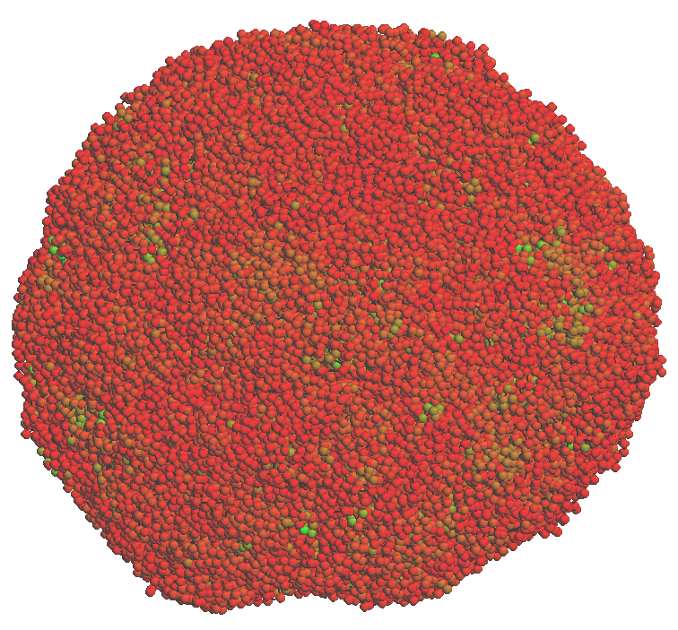
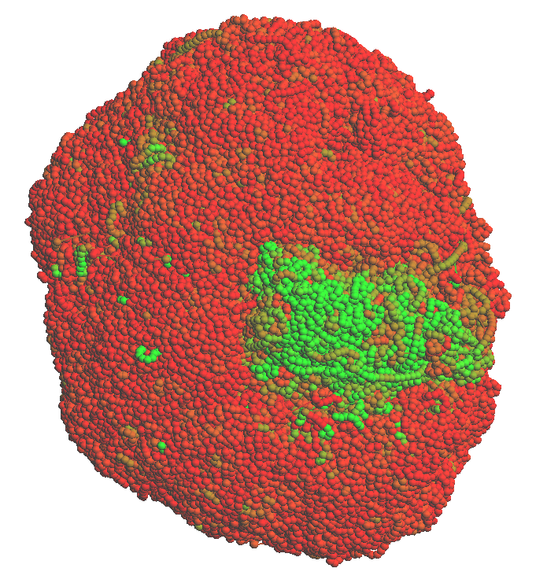

## <a name="start"></a>Getting Started
```sh
# Download precompiled binaries for Linux
curl -L https:// | tar -jxf -
cd hickit-0.1_x64-linux

# Map Dip-C reads and extract contacts (skip if you use your own pipeline)
./seqtk mergepe read1.fq.gz read2.fq.gz | ./pre-dip-c - | bwa mem -p hs37d5.fa - | gzip > aln.sam.gz
./k8 hickit.js sam2seg -v phased_SNP.tsv aln.sam.gz | ./k8 hickit.js chronly - | gzip > contacts.seg.gz
./hickit pair --out-phase -Dd0 contacts.seg.gz | bgzip > contacts.pairs.gz  # optional

# Impute phases (the input file can also be contacts.seg.gz)
./hickit pair -p contacts.pairs.gz | bgzip > impute.pairs.gz
./hickit pair -v.1 contacts.pairs.gz > contacts.val  # estimate phasing accuracy by holdout
# Infer 3D structure (`hickit bin -g` will get called multiple times on the input)
./fdg-multi.pl impute.pairs.gz | sh

# 2D contact map in PNG (bin size determined by the image width)
./hickit image2d -w 800 -o impute.png impute.pairs.gz
# Compute CpG density (optional; easy with your own scripts, too)
./hickit.js gfeat -r hs37d5.fa.gz impute.3dg.gz | gzip > impute.cpg.3dg.gz
# Visualize 3D structure (requiring a graphical card)
./hickit-gl view3d impute.cpg.3dg.gz
```

## Table of Contents

* [Getting Started](#start)
* [Introduction](#intro)
* [Installation](#install)
* [Users' Guide](#guide)
  - [Terminologies](#term)
  - [File formats](#format)
    - [The pairs format](#pairs)
    - [The 3dg format](#3dg)
    - [The seg format](#seg)
  - [Generating contacts in the pairs format](#gen-pairs)
    - [Aligning Hi-C reads](#aln-hic)
    - [Extracting contact pairs](#extract-pairs)
  - [Imputing missing phases (diploid single-cell Hi-C only)](#impute)
  - [Inferring 3D structures](#infer-3d)

## <a name="intro"></a>Introduction

Hickit is a set of tools initially developed to process diploid single-cell
Hi-C data. It extracts contact pairs from read alignment, identifies phases of
contacts overlapping with SNPs of known phases, imputes missing phases, infers
the 3D structure of a single cell and visualizes the structure. Part of the
hickit functionality also works with bulk Hi-C data. In particular, hickit
implements a fast (untested) binning-free TAD calling algorithm and an
efficient neighboring contacts counter which can be adapted to ultrafast loop
calling.

## <a name="install"></a>Installation

Hickit depends on [zlib][zlib]. The command-line tools can be compiled by
typing `make` in the source code directory. The 3D viewer (i.e. the `view3d`
command) further requires OpenGL and GLUT and can be compiled with `make gl=1`.

## <a name="guide"></a>Users' Guide

The "Getting Started" section above presents a brief walkthrough of the hickit
functionality. The following gives more details and explanations.

### <a name="term"></a>Terminologies

A *contact* is a pair of chromosomal coordinates that are supposed to be close
to each other, inferred from Hi-C or other 3C technologies. A *contact pair* or
sometimes a *pair* is taken as a synonym of contact. A *leg* is one of the two
chromosomal coordinates in a contact pair.

### <a name="format"></a>File formats

#### <a name="pairs"></a>The pairs format

Hickit takes the [pairs format][pairs-fmt] as the primary data format to store
raw contact pairs, binned pairs and phasing information. It uses `phase1` and
`phase2` columns to store phasing. For example,
```txt
#columns: readID chr1 pos1 chr2 pos2 strand1 strand2 phase1 phase2
.   1   3194588 1   4266988 -   +   .   0
.   1   3195262 1   7393633 +   +   .   .
.   1   3201962 1   6016262 +   -   1   .
```
Phase imputation estimates the probablity of the four possible phases in a
diploid genome, which are written to the p00, p01, p10 and p11 columns like
```txt
#columns: readID chr1 pos1 chr2 pos2 strand1 strand2 p00 p01 p10 p11
.   1   3194588 1   4266988 -   +   0.990   0.000   0.010   0.000
.   1   3195262 1   7393633 +   +   0.605   0.005   0.005   0.385
.   1   3201962 1   6016262 +   -   0.000   0.000   0.010   0.990
```

#### <a name="3dg"></a>The 3dg format

Hickit describes the 3D genomc coordinates in the following format:
```txt
1a  3360000 0.377249    -0.280691   -0.861085   0.030120
1a  3560000 0.406092    -0.173746   -0.795618   0.032090
1a  3580000 0.429502    -0.092491   -0.822528   0.027910
```
where each line consists of chr name, start position, X, Y and Z coordinates.
The 6th column optionally stores a feature value (CpG density in this example).
Hickit's 3D viewer may color chromosomes by this column if present.

#### <a name="seg"></a>The seg format

This is an intermediate format used by hickit to store raw contacts directly
inferred from read alignment. It is generally adviced to convert this format to
pairs with:
```sh
./hickit pair --out-phase -Dd0 contacts.seg.gz | bgzip > contacts.pairs.gz
```

### <a name="gen-pairs"></a>Generating contacts in the pairs format

If you have your own pipeline to produce contact pairs, please ignore this
section.

#### <a name="aln-hic"></a>Aligning Hi-C reads

If have normal Hi-C reads, you can align directly with [bwa-mem][bwa]:
```sh
bwa mem -p hs37d5.fa read1.fq.gz read2.fq.gz | gzip > aln.sam.gz
```
Note that the hickit pipeline only works with bwa-mem or minimap2 because most
other aligners do not produce chimeric alignments.

If you have Dip-C reads, you need to preprocess the reads with`pre-dip-c` from
the [pre-pe][pre-pe] and then align with [bwa-mem][bwa]:
```sh
seqtk mergepe read1.fq.gz read2.fq.gz | pre-dip-c - | bwa mem -p hs37d5.fa - | gzip > aln.sam.gz
```

#### <a name="extract-pairs"></a>Extracting contact pairs

When you don't have phasing information, you can generate contact pairs with
```sh
hickit.js sam2seg aln.sam.gz | hickit.js chronly - | gzip > contacts.seg.gz
hickit pair -Dd0 contacts.seg.gz | bgzip > contacts.pairs.gz
```
When you have phased SNPs in VCF, you can generate contact pairs with the phase columns
```sh
hickit.js vcf2tsv NA12878_phased.vcf.gz > phased_SNP.tsv
hickit.js sam2seg -v phased_SNP.tsv aln.sam.gz | hickit.js chronly - | gzip > contacts.seg.gz
hickit pair --out-phase -Dd0 contacts.seg.gz | bgzip > contacts.pairs.gz
```
where `hickit.js chronly` filters out non-chromosomal contigs and
`phased_SNP.tsv` keeps phased SNPs, which looks like
```
chr1    1010717 C       T
chr1    1011531 T       C
chr1    1013136 C       G
```

### <a name="impute"></a>Imputing missing phases (diploid single-cell Hi-C only)

Because SNPs are sparse, only a tiny fraction of contacts are fully phased. To
impute missing phases, you can
```sh
hickit pair -p contacts.pairs.gz | bgzip > impute.pairs.gz
```
The output is still in the pairs format. The last four columns give the
pseudo-probability of four possible phases, inferred by an EM-like algorithm. A
number 0.75 or above is generally considered reliable based on held-out
validation. You can perform such a validation with
```sh
hickit pair -v.1 contacts.pairs.gz > impute.val
```
This command line holds out 10% of legs with known phases, impute them back
from other contacts and then estimate the accuracy. The output is TAB-delimited
with each line consists of probability threshold, sensitivity of
intra-chromosome contacts close to the diagonal, accuracy of such contacts,
sensitivity of off-diagonal contacts, accuracy of such contacts, sensitivity of
all contacts and accuracy of all contacts.

### <a name="infer-3d"></a>Inferring 3D structures

The `hickit bin -g` command infers 3D structures at one resolution. It is
recommended to performs the inferrence multiple times at different scales. The
`fdg-multi.pl` script simplies this procedure:
```sh
./fdg-multi.pl impute.pairs.gz | sh
```
Without the `| sh` pipe at the end, `fdg-multi.pl` prints the hickit command
lines. You can see that the script asks hickit to infer at the 4M, 1M, 200k,
50k and 20k resolutions, with each command takes the previous inferred
structure as input. We learned the idea from [nuc\_dynamics][nuc-dyn].

To check the crude quality of a 3D structure, we encourage to compute the CpG
density with
```sh
hickit.js gfeat -r hs37d5.fa impute.3dg.gz | gzip > impute.cpg.3dg.gz
```
For PBMC cells and LCL cells, we typically see low-CpG regions placed at the
periphery, which leads to a red ball like



For these cell types, a problematic inference often has large areas of greens
(high CpG density):



[zlib]: http://zlib.net
[pre-pe]: https://github.com/lh3/pre-pe
[bwa]: https://github.com/lh3/bwa
[pairs-fmt]: https://github.com/4dn-dcic/pairix/blob/master/pairs_format_specification.md
[nuc-dyn]: https://github.com/tjs23/nuc_dynamics
